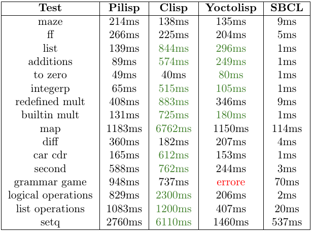

# pilisp #

[](https://travis-ci.com/parof/pilisp) [](https://codecov.io/gh/parof/pilisp) [](https://parof.github.io/pilisp/)

* [Introduction](#introduction)
* [Language](#language)
* [Documentation](#documentation)
* [Installation](#installation)

## Introduction ##

Pilisp aims to be a small LISP interpreter for the 1.5 version of the language described [here](http://www.softwarepreservation.org/projects/LISP/book/LISP%201.5%20Programmers%20Manual.pdf).

### Features ###

* **Lambdas**: (lambda ({args}) {body}) syntax allowed
* **Garbage Collector**: mark and sweep garbage collector
* **Bytecode virtual machine interpreter**: some simple lambdas can be compiled to a bytecode faster version
* **Memory dump builtin**: (md) prints the structure of the allocated memory

### Performance ###

These are the performances compared to other Lisp interpreters: [CLisp](https://clisp.sourceforge.io/), Yoctolisp (similar performances to [Femtolisp](https://github.com/JeffBezanson/femtolisp)) and [SBCL](http://www.sbcl.org/).





## Language ##

The language accepted by the interpreter is inspired to the [Common Lisp](https://en.wikipedia.org/wiki/Common_Lisp), but keeps the _homoiconicity_ feature of the original definition of the LISP 1.5: data and instructions are kept together in the same data structure, the _cons cell_.

### Builtin functions ###

* Lisp basic functions
    * car
    * cdr
    * cons 
    * atom
    * eq
    * quote
    * cond
* Arithmetic
    * \+
    * \-
    * \*
    * \/
* Logic
    * or
    * and 
    * not
* Comparison
    * \>
    * \>=
    * \<
    * \<=
    * integerp
    * symbolp
* Lists operations
    * list
    * reverse
    * member 
    * nth
    * concatenate
    * append
    * length
    * subseq
* Common Lisp inherited functions
    * set
    * write
    * load
    * bye
* Macros
    * setq
    * defun
    * let
    * dotimes
    * map
    * time
    * defmacro
* Pilisp special functions
    * md: prints the memory
    * env: prints the global env
    * cg: calls the garbage collector

### Bytecode instruction set ###

You can optionally produce one mid-representation for some expression. The bytecode will run faster than normal LISP code. 
To achieve this goal Pilisp interpreter adds these instructions to the language: 

* **plc**: PiLisp Compiler. Called on one sexpression tries to produce the corresponding bytecode of one quoted expression.
    
    ```
    (plc '(car '(a))) => (ASM "!$B" (A) CAR)
    ```

* **asm**: c-like notation for assembly. This instruction can be interpreted. The first arg is the machine code. Refer [here](#instructionset) for the list of codes. The other arguments are the parameters.

    ```
    (ASM "!$B" (A) CAR)
    ```
    has to be read as: `load a const -> that const is (A) -> apply a builtin function -> That function is car -> That function has 1 parameter -> Put the result on the top of the stack` . The result of a computation is always the top of the stack.

* **lasm**: lambda-asm. Represents a asm computation that accepts input parameters: it is a compiled lambda. The first parameter represents the number of parameters. The rest of the parameters are the same as asm.

    ```
    ((LASM 1 "@A!$C" 1 +) 2)
    ```
    The last is an example of the 1+ function compiled and  applied to the number 2

* **compile**: tries to compile one function. If this is possible the new definition will be substituted to the old one.

    ```
    (defun id (x) x)
    (compile id)
    ```
    will produce a new and faster identity function.
    

#### Instruction set ####
| Code        | Meaning         |
| :---:       | :---:           |
| !           | load constant   |
| ?           | load symbol     |
| @           | load name from stack     |
| $           | apply builtin lambda      |
| \[A-Z\]     | numbers from 0 to 25     |


## Documentation ##

Full code documentation can be found on [github pages](https://parof.github.io/pilisp/). It is automatically generated using [Doxygen](http://www.stack.nl/~dimitri/doxygen/), with [Bootstrap](https://getbootstrap.com/) CSS (using [this](https://github.com/Velron/doxygen-bootstrapped) guide). The code documentation is generated every push with [Travis CI](https://travis-ci.org/), so it should be always up to date.

## Installation ##

### Prerequisites ###

* [Meson](http://mesonbuild.com/)   (version 0.44 or newer)
* [Python](https://www.python.org/) (version 3.5 or newer)
* [Ninja](https://ninja-build.org/) (version 1.5 or newer)

### Installing with Meson ###

These commands should run on any OS. To build the `ninja.build` file run. The `-Dc_args` will add optimizations.

```
meson build -Dc_args=-Og
```

To build the executable in the `build` directory run

```
ninja -C build
```

To install `pilisp` run with root permissions

```
ninja install -C build
```

To run tests use

```
ninja test -C build
```

By default Meson won't allow debugging: if you want to run a debbuger you have to write:
```
meson build -Db_coverage=true
```

Run with Valngrid:
```
meson test --wrap=valgrind 'testname'
```
